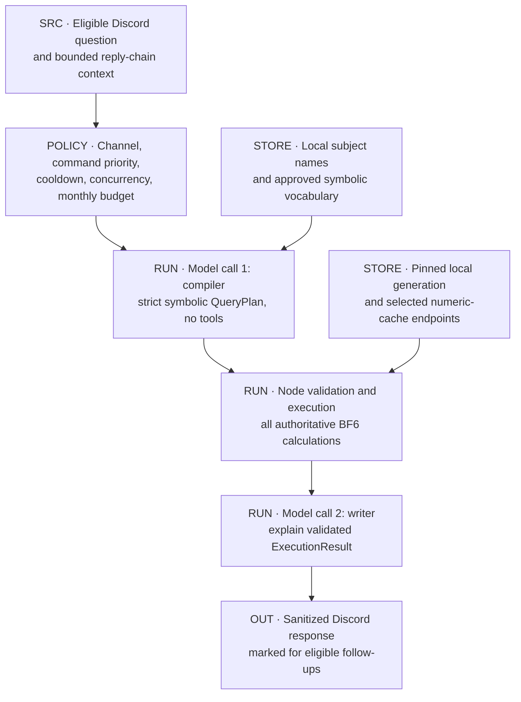
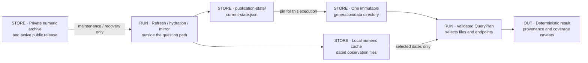
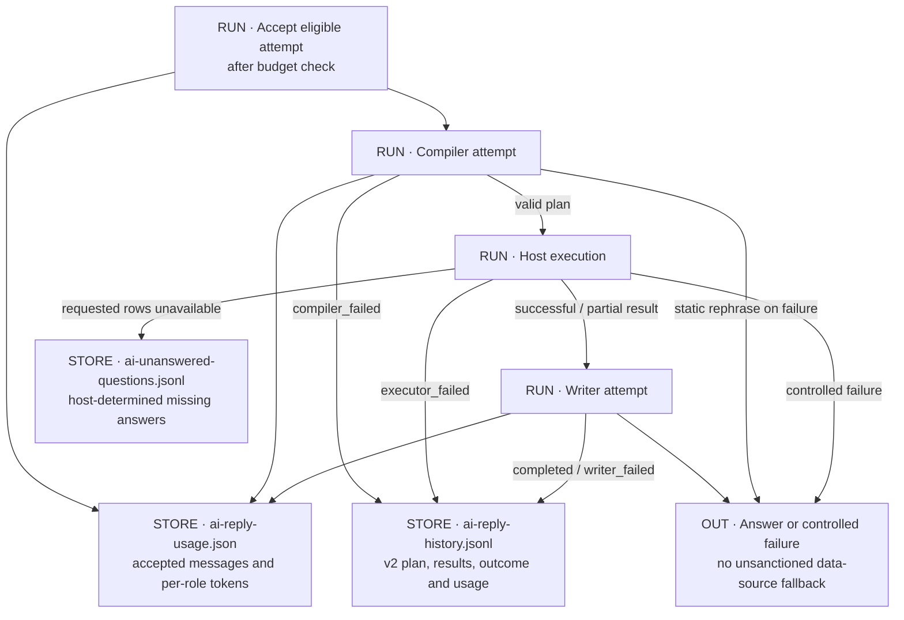
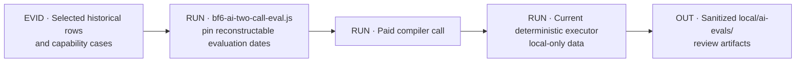

# AI response path

[Atlas](README.md) · [Collection and Discord](COLLECTION_DISCORD.md) · [Artifact contract](REFRESH_PUBLICATION.md#artifact-contract)

## D12 · Two model calls around a deterministic executor

A message is eligible if it tags the bot in a configured BF6 channel, or replies directly to an AI answer or to an overtake message (both carry an invisible marker). Replies to other bot messages, messages from bots and webhooks, and untagged conversation are ignored. BF6 commands take priority. Quoted messages and earlier reply-chain text are passed as bounded, untrusted context.

1. **Compiler.** Receives the question, the bounded context, member identities and names, and a catalogue of approved subjects, metrics, items, categories and operations. It does not receive the numeric dataset. It returns a symbolic `QueryPlan`.
2. **Executor.** Node validates the plan, loads only the local data it needs, resolves windows and subjects, performs every calculation, and builds an `ExecutionResult`. Full-cohort operations evaluate the whole eligible roster before slicing the output. Explicitly requested subjects are never dropped by truncation.
3. **Writer.** Receives the plan and the result, has no tools, and is instructed to explain the result without computing new numbers. Its output is not checked number by number. Partial coverage and unavailable rows must appear in the answer.

Ordinary chat follows the same path with an empty result and no numeric reads. A compiler, schema or validation failure stops after call 1 with a fixed "please rephrase" reply. An incomplete writer response is not retried.

### Data sent to each stage

| Destination | Receives | Does not receive |
|---|---|---|
| Compiler | Question, bounded quoted context, symbolic catalogue, identities and names | Numeric history, raw GameTools payloads, credentials, tools |
| Executor | Validated plan and local data | Instructions from quoted context |
| Writer | Plan, computed results, required caveats, bounded context | Tools or data access |
| Discord | Sanitized final text with mentions suppressed | Model-control objects, credentials, query datasets |

The model, reasoning effort, output-token limits, per-user cooldown and monthly message cap are set in configuration; see the [AI guide](../BF6_AI_REPLIES.md). The compiler and writer have separate token accounting.

## D13 · Local-only statistics access

Answering a question reads only local files on the Mini PC: no GameTools, R2, delivery Worker or GitHub. If a required local file is missing, the executor fails instead of falling back to a remote source. R2 feeds the local files through refresh and hydration, outside the question path.

- Subject names come from local `latest.json`, cached per generation.
- Each execution pins the active generation's `data/` directory.
- Numeric history comes from the local numeric cache. `bf6-query-local-data.js` selects the dated endpoints the plan needs; some equipment metrics also scan the dates in between for coverage.
- Current equipment values come from `equipment-index.json`. Item and field combinations missing from it fall back to the local numeric cache, with the provenance labelled.
- If a field started being collected after the requested window began, the result is clamped to the covered range or reported as unavailable.

Pinning keeps one execution on one generation. The numeric cache, registry changes and model responses are not part of that pin. Roster changes invalidate AI caches separately ([D03](COLLECTION_DISCORD.md#d03--roster-visibility-and-removal)).

## D14 · Outcomes, accounting and failure handling

| Local file | Contents |
|---|---|
| `data/ai-reply-history.jsonl` | Version 2 rows: validated plan and result, missing reasons, compiler and writer settings, timing, tokens, outcome. Version 1 rows are from the retired single-call design |
| `data/ai-reply-usage.json` | Version 2 counters: accepted messages, compiler and writer requests, input and output tokens per role. The monthly cap counts accepted messages, not tokens. Version 1 files migrate with their spent budget |
| `data/ai-unanswered-questions.jsonl` | Questions the executor could not fully answer, with message and channel context. The executor decides completeness, not the writer |

`AI_REPLY_HISTORY_PATH`, `AI_REPLY_USAGE_PATH` and `AI_UNANSWERED_LOG_PATH` override the paths; production uses the defaults. These files are gitignored and have no offsite backup ([D28](ARCHIVES.md#d28--mini-pc-disk-loss)). A writer failure can still cost tokens. Malformed usage files are reported as errors, not read as zero spend.

The bot's voice allows playful competitive replies but no administrative actions. User, role, `@everyone` and `@here` pings are suppressed. Questions about command syntax point to the pinned instructions.

## D15 · Offline evaluation

`npm run eval:bf6-ai-two-call` replays selected history rows and capability cases through a paid compiler call and the current executor. It does not call the writer or post to Discord. Relative periods are evaluated as of the original question date when the inputs can be reconstructed; intraday cases without reconstructable inputs get semantic review only. Old reply text is provenance, not an expected answer.

## Source anchors

[AI service and sanitization](../../src/ai-replies.js), [compiler](../../src/bf6-query-compiler.js), [executor](../../src/bf6-query-executor.js), [local query reader](../../src/bf6-query-local-data.js), [local stats loader](../../src/bf6-ai-stats.js), [approved metrics](../../src/bf6-query-metrics.js), [window selection](../../src/bf6-query-windows.js), [evaluator](../../tools/bf6-ai-two-call-eval.js), [AI guide](../BF6_AI_REPLIES.md).
