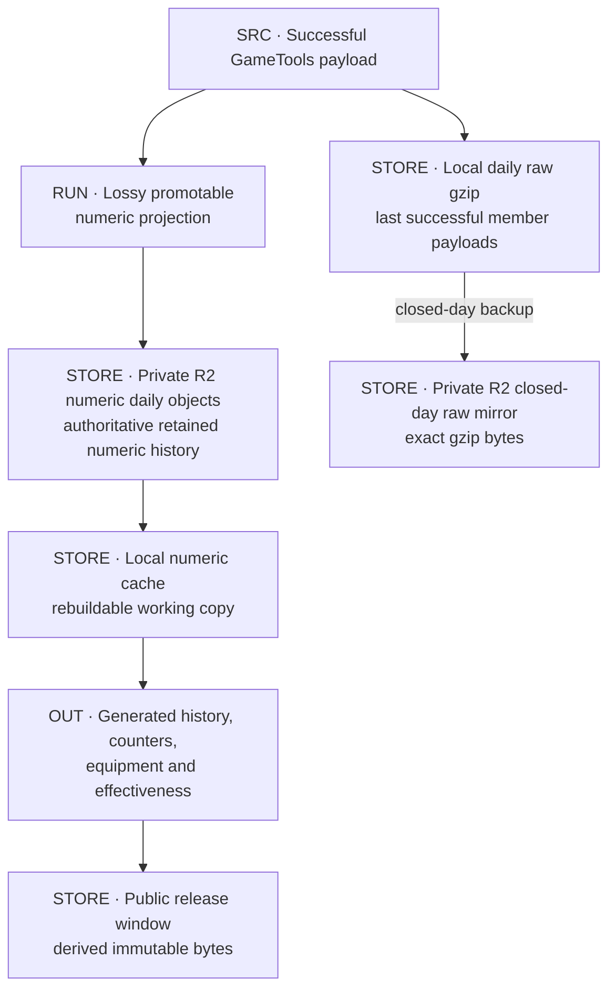
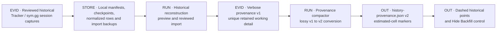
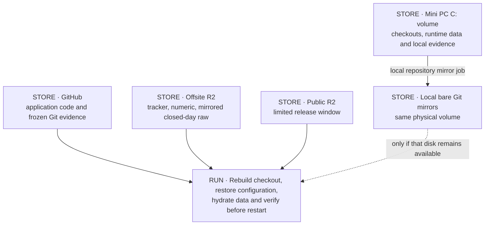

# Archives and durability

[Atlas](README.md) · [Operations](OPERATIONS.md) · [Ownership and retention guide](../BF6_DATA_OWNERSHIP_AND_RETENTION.md)

## D26 · Stores, authority and fidelity

"Raw" means the member payload is stored unprojected. It is not a log of every request: both the raw daily file and the numeric daily object keep the latest successful payload per member per tracker day. The R2 raw mirror is a byte-for-byte copy of the closed-day gzip, once the upload succeeds.

### Storage register

| Store | Writers → readers | Authority and retention |
|---|---|---|
| Private R2 `tracker-state/current.json` | Registry adapters on the Mini PC and Actions | Live tracker document. Local writes serialized; cross-host writes use ETag CAS |
| Private R2 `tracker-state/backups/YYYY-MM-DD.json` | Daily backup job → operator restore | Immutable UTC-day snapshots, newest seven kept |
| Private R2 `bf6/numeric/daily/<date>.json` | Archive stage → publisher, hydration, export, health | **Authoritative numeric history.** Projected (lossy), kept indefinitely |
| Local `<BF6_NUMERIC_CACHE_DIR>` | R2 hydration and publication → publisher, AI | Working copy, rebuildable from R2 |
| Local `data/bf6-full-archive/<date>.json.gz` | Fresh collection → raw tooling | Unprojected payloads, kept indefinitely. The open day and any upload backlog exist only on this disk |
| Private R2 `bf6/raw/daily/<date>.json.gz` | Closed-day raw backup → recovery and re-audit | Offsite copy of the raw day, kept indefinitely. Mirroring never deletes local files |
| Local `pipeline-state.json`, receipts, `outbox/` | Pipeline and retry dispatcher | Resume state for the Mini PC. Incomplete envelopes are not aged out. No offsite copy |
| Local `publication-state/current-state.json` and generations | Publisher and hydration → publisher, AI | Selects the current local generation. Rebuildable from R2 |
| Private R2 `refresh-recovery/<refresh-id>.json` | Actions restore / persist | Resume bundles: completed kept 24 hours, incomplete seven days, unreadable kept for inspection |
| Actions incomplete-run artifact | Workflow cleanup → operator retry | Kept one day |
| Public R2 `current.json` and `releases/<id>/` | Publisher → Worker, browser, verifier, retention | Served bytes. Active release plus 30 superseded |
| `kdm-bf6-archive/archive/bf6/` | None | Frozen numeric data through 2026-09-03, for rollback and comparison |
| `kdm-bf6-rankings/data/` | None | Frozen website data, for rollback; editing it does not change the live site |
| D1 `kdm-web-analytics` | Traffic Worker → dashboard API | Site-traffic aggregates, kept indefinitely |
| AI logs, `local/`, historical capture workspace | Bot, evaluator, operator | Diagnostics and unique evidence. Gitignored, no offsite backup |

The numeric daily objects are the source of truth; the retired `bf6/numeric/inventory.json` is not used. Retired tracker-generation protocols and the old multi-object Actions recovery layout are not recovery paths. Git and dual publication code remains for compatibility; routine writes go to R2.

### Coverage

The frozen numeric snapshot covers 56 tracker days, 10 July – 3 September 2026. Raw gzip coverage starts on 12 August. For the 33 days from 10 July to 11 August, the projected numeric history is the only record.

Per-item fields widened on 10 August to include cumulative headshot kills, shots hit and fired, equipment time and vehicle-archetype data. Earlier days have no counts for these fields, and a stored percentage cannot be converted back into counts. Later projections can backfill only from retained observations; missing rank is left missing, not interpolated.

## D27 · Historical reconstruction and provenance

The July 2026 Tracker.gg backfill was a one-time reconstruction. Its tooling is in `tools/historical/tracker-backfill/`, outside the npm scripts and the default test suite, and it needs the original local captures to run.

Published `history-provenance.json` (v2) marks estimated cells before the 10 July anchor. The local verbose v1 file also holds source, confidence and grouped-session detail. v1 cannot be rebuilt from v2, so keep the raw captures and the v1 file if the backfill may need re-auditing.

`docs/archive/` holds completed plans, incident evidence and reviews. `docs/deferred/` holds proposals that are not implemented. The repository's `backups/` exports and old `state/` directory are historical files, not ongoing backups.

## D28 · Mini PC disk loss

The mirror script keeps bare copies of the bot, rankings and archive repositories, with all refs, under `C:\Bots\backups`. They are on the production disk, and they exclude ignored runtime data, `.env` and credentials.

| Survives disk loss | Lost with the disk |
|---|---|
| Code and frozen snapshots on GitHub | Open raw day and any unmirrored raw backlog |
| Tracker state, backups, numeric history and mirrored raw days in private R2 | AI logs and usage counters |
| Retained public releases | Pipeline state, receipts and recovery outbox |
| D1 traffic history | Local historical capture workspace and v1 provenance |
| | `.env` and host configuration |

No machine-level backup of `C:\ProgramData` or the checkout is currently confirmed, and no full restore has been tested.

### Recovery sources

| Need | Start from | Do not use |
|---|---|---|
| Rebuild numeric history or counters | Private numeric daily objects, in date order | The frozen Git snapshot for days after 3 September |
| Recover fields dropped by projection | A raw gzip day, local or mirrored | Public JSON, or dates before raw capture began |
| Resume an incomplete publication | The local envelope and state, or a restored Actions bundle | A new collection |
| Restore member mappings and registries | A validated tracker daily backup, with controlled writes | Public `latest.json`, which is filtered |
| Recreate a retained public release | That release in R2 | Current formulas run on old inputs, which can produce different bytes |
| Re-audit the pre-tracking backfill | Original captures, manifests and v1 provenance | The published v2 markers |
| Restore site-traffic history | D1 | The BF6 archive |

## Source anchors

[Ownership/retention](../BF6_DATA_OWNERSHIP_AND_RETENTION.md), [R2 architecture](../R2_RIGHT_SIZED_ARCHITECTURE.md), [tracker document schema](../../src/tracker-state-schema.js), [tracker CAS adapter](../../src/tracker-state-r2-simple.js), [tracker backups](../../src/tracker-state-r2-backup.js), [numeric R2](../../src/bf6-numeric-archive-r2.js), [raw local archive](../../src/bf6-local-full-archive.js), [raw backup](../../src/bf6-raw-archive-backup.js), [bare mirror script](../../scripts/kdm-backup-mirror.ps1), [historical tooling](../../tools/historical/tracker-backfill/README.md), [local evidence inventory](../../tools/README.md), [frozen archive contract](https://github.com/raymdl/kdm-bf6-archive/blob/e3eaddac203a9a60da572b10b9070b93a669e307/README.md).
