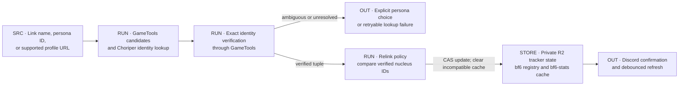
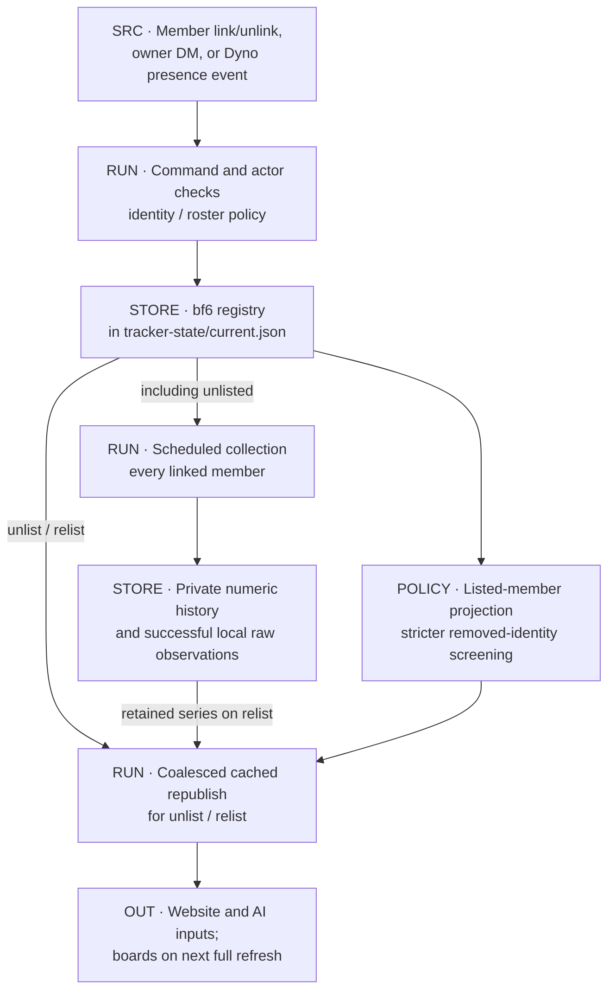
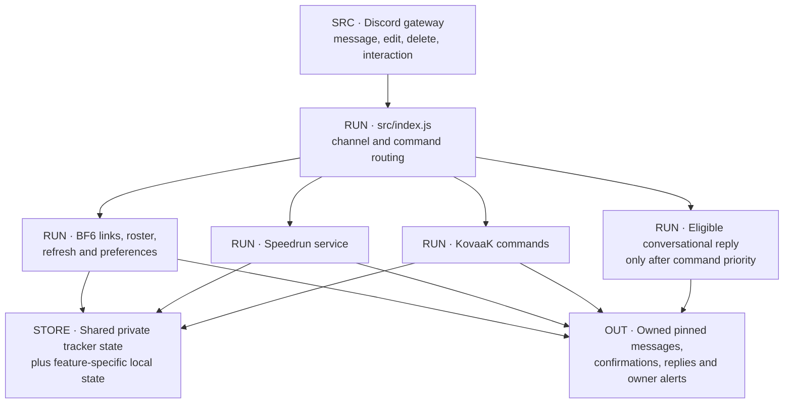
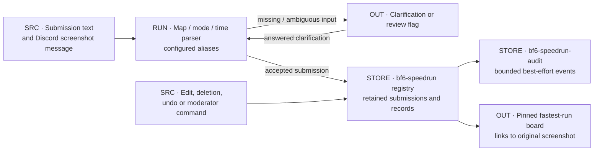
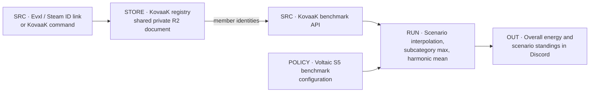

# Collection and Discord

[Atlas](README.md) · [Refresh pipeline](REFRESH_PUBLICATION.md) · [AI](AI.md)

## D02 · Identity resolution and account boundaries

A verified identity is a tuple of persona/player ID, nucleus ID, identity platform and available platform metadata. Only this tuple goes into batch statistics requests. Preferred launch platform and reviewed Tracker.gg mappings are stored as separate metadata.

The resolver collects exact persona matches from GameTools and from Choriper (a second identity-lookup API), then deduplicates them. Choriper supplies candidates only, never statistics. If more than one usable persona matches, the member must choose. A failed lookup returns a retry or clarification message.

On relink, the nucleus IDs are compared. A same-account relink keeps the Tracker.gg mapping. A different or unverifiable nucleus clears the mapping and the cached statistics, so a new account never inherits the old account's numbers.

## D03 · Roster visibility and removal

| Action | Collection | Public output | Retained history |
|---|---|---|---|
| Unlist | Continues | Removed from new releases | Kept |
| Relist | Continues | Restored, including the series collected while unlisted | Kept |
| Unlink / remove | Stops | Removed at the next full refresh; removed identities get stricter alias and profile-URL screening | Kept |

Older public releases that are still retained can contain a member who was listed when they were published. Names and audit history are not filtered.

Unlist and relist update the registry, post a confirmation, invalidate the AI caches and queue one cached site publication. Changes that arrive during that publication trigger one more run. The AI caches are invalidated again after publication. Discord standings update at the next full refresh. The surfaces therefore change at different times.

## D04 · The live Discord process

The gateway client subscribes to guild messages, DMs, message content and interactions. Message and channel partials let the speedrun service see deletions of messages that are not in the process cache. A merged commit reaches the bot only after the supervisor updates and restarts it ([D21](OPERATIONS.md#d21--code-deployment-and-data-publication)).

| Interaction | Effect |
|---|---|
| `!b6-link` / `!bf6-link`, `!b6-unlink` | Verify or remove the mapping, persist shared state, confirm, and debounce refreshes across rapid link changes |
| `!bf6-refresh` | Full refresh with status updates, boards and publication; the owner can also run it by DM |
| `!bf6-site-stat <stat> [@member]` | Keeps and publishes only the selected site field; no standings rewrite or overtake message |
| `!bf6-mute` / `!bf6-unmute` | Turn overtake tags off or on; collection and display continue |
| Owner roster DM | Unlist, relist, list unlisted, remove, each with confirmation; only the configured owner ID in a one-to-one DM |
| Dyno presence messages | Validated leave and rejoin messages from the Dyno moderation bot drive roster changes; missed messages are caught up |
| Other conversation | Ignored unless it meets the [AI reply rules](AI.md) |

The BF6 rankings channel holds six Top-10 stat embeds and a Profiles message. The website carries the full stat list. Board sync finds the bot's own messages and recreates any that are missing.

## D05 · Speedruns

The parser reads the submission text. The screenshot is stored as a link to its Discord message; there is no image recognition. The screenshot can belong to another member. Deleting either the submission or its screenshot removes the entry, and the next-fastest retained run becomes the record. On an exact tie the first run keeps the record. A saved cursor replays messages missed while the bot was offline.

`config/bf6-speedrun-maps.json` defines aliases, modes, map slugs and display order. Runs under 120 seconds are flagged for review. There is no maximum time. Anyone in the channel can undo the newest submission; other correction commands can be restricted to a role. The audit log keeps 1,000 events by default, and an audit write failure does not reject the submission.

## D06 · KovaaK

KovaaK shares the host, Discord application, tracker-state document and Actions fallback with BF6. Its scores do not enter BF6 artifacts or the AI executor. Slash commands cover channel selection, refresh, status and link instructions; a message command stores the member's Evxl ID. `config/benchmarks.json` and `src/kovaaks.js` define the benchmark and the energy calculation.

## Source anchors

[Gateway routing](../../src/index.js), [identity collection](../../src/bf6.js), [links](../../src/bf6-links.js), [relink policy](../../src/bf6-relink.js), [persistence](../../src/bf6-link-persistence.js), [Tracker metadata](../../src/bf6-tracker-links.js), [roster policy](../../src/bf6-roster-policy.js), [owner commands](../../src/bf6-admin.js), [presence](../../src/bf6-member-presence.js), [roster republish](../../src/bf6-roster-site-publish.js), [speedrun service](../../src/bf6-speedrun.js), [KovaaK math](../../src/kovaaks.js).

Guides: [member commands](../BOT_COMMANDS.md), [identity waterfall](../BF6_PROFILE_MATCHING_WATERFALL.md), [stats and collection](../BF6_STATS_AND_COLLECTION.md), [speedruns](../BF6_SPEEDRUNS.md).
