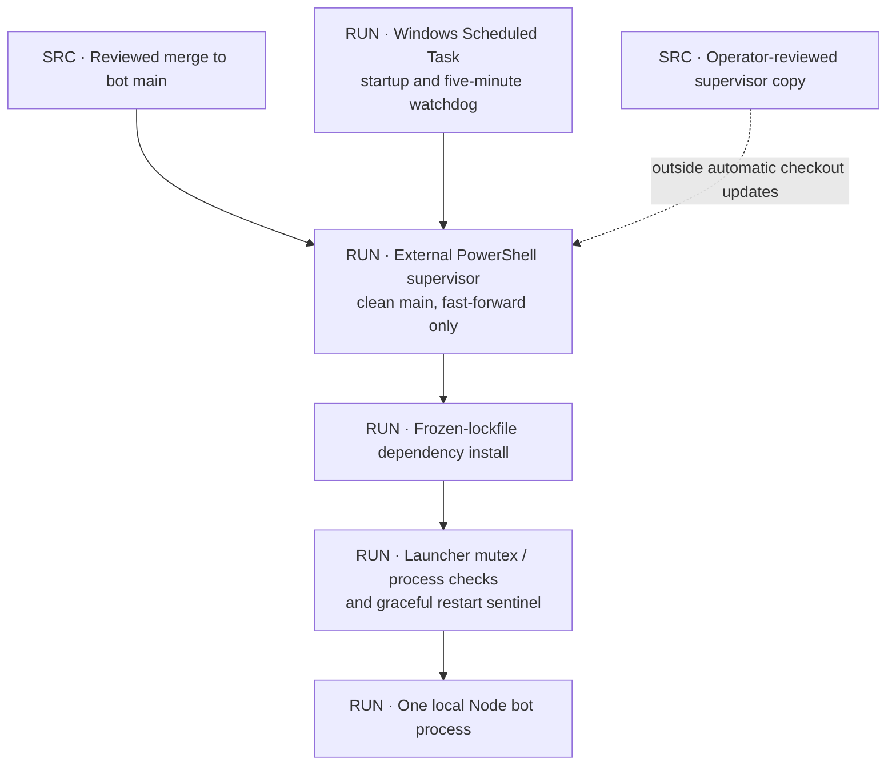
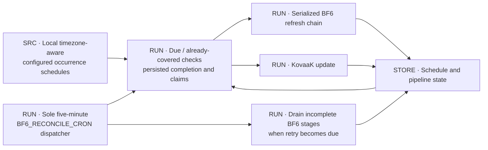
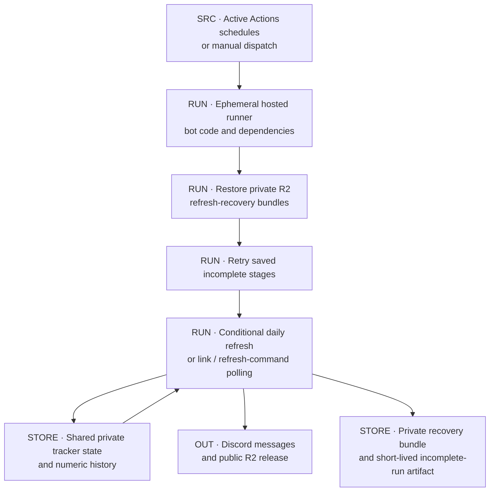
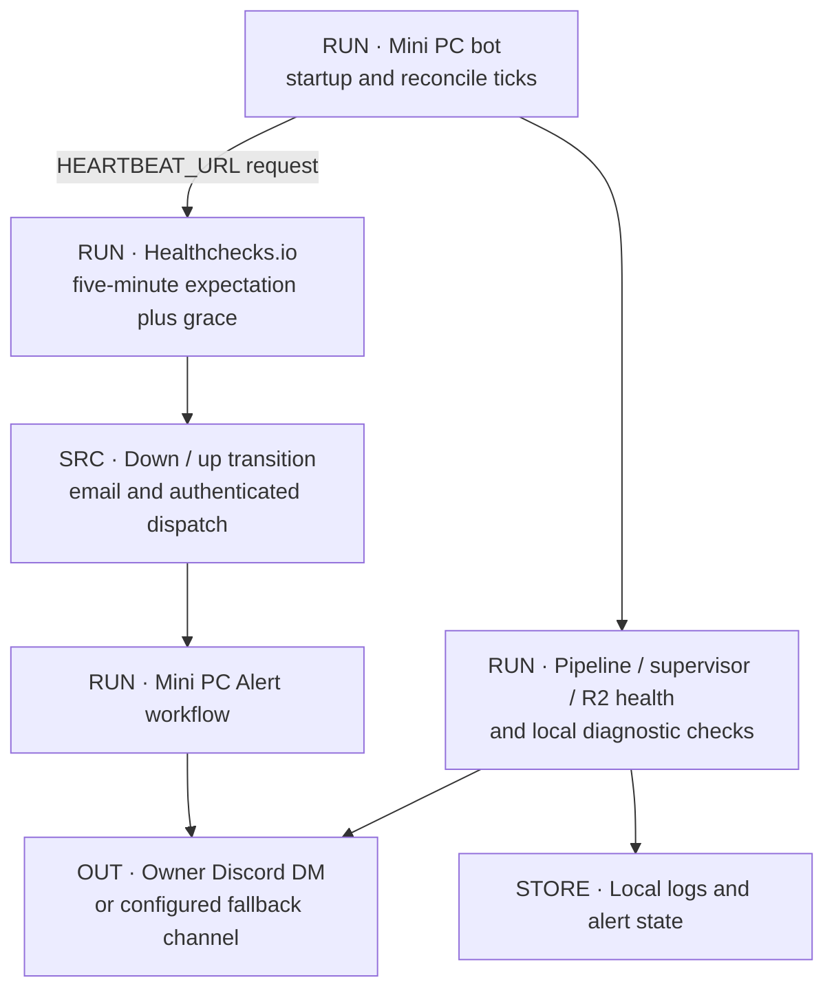
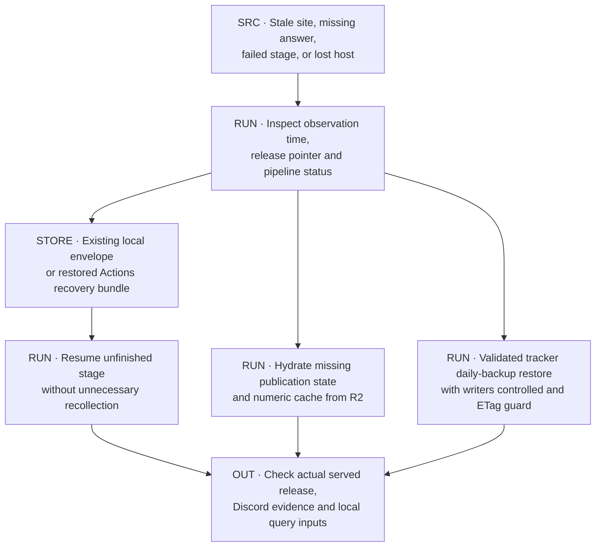

# Operations and recovery

[Atlas](README.md) · [Archives](ARCHIVES.md) · [Change register](REGISTER.md)

## D21 · Code deployment and data publication

Production runs on a headless Windows Mini PC. The main PC is for development only. A Scheduled Task starts the supervisor at boot and every five minutes. The deployed supervisor sits outside the checkout so an update cannot replace it mid-run.

| Location | Purpose |
|---|---|
| `C:\Bots\kdm-discord-bot` | Production checkout |
| `C:\Bots\kdm-bot-supervisor.ps1` | Deployed supervisor; copy changes to it by hand |
| `scripts/kdm-bot-supervisor.ps1` | Tracked source of the supervisor |
| `scripts/start-local-bot.ps1` | Launcher: single-process guards, log rotation, restart handshake |
| `C:\ProgramData\KDM\bf6-refresh-pipeline` | Envelopes, pipeline state, notification receipts, publication generations |
| `C:\Bots\kdm-bf6-rankings` | Site checkout; not written in R2 mode |
| `data/bot.log`, `data/bot.err.log`, `data/auto-update.log` | Runtime and deployment logs |

The supervisor updates only a clean `main` by fast-forward, then installs from the frozen lockfile and restarts the bot.

| Condition | Result |
|---|---|
| Fetch fails | Bot keeps running on the current revision |
| Branch diverged or tracked files changed | Update blocked; nothing is reset |
| Dependency install fails | Restart blocked; retried next cycle |

The launcher requests a graceful exit through `data/bot-restart-requested`. The bot finishes its current BF6 refresh chain, with a bounded force-stop fallback. A mutex and process checks prevent a second local instance; they do not coordinate with GitHub Actions. The tracked and deployed supervisor copies can drift apart if the deployed copy is not updated after a change.

## D22 · Scheduling by occurrence reconciliation

The bot has one cron job, the five-minute reconcile tick (minute `:02`, `:07`, and so on). The other cron expressions only define when work is due. Each tick runs any due occurrence that has not been completed, so a late tick recovers a missed run.

| Work | Schedule |
|---|---|
| BF6 refresh | 09:00, 13:00, 16:00, then hourly 19:00–01:00 `America/New_York` |
| End-of-day snapshot | 23:45 `America/Los_Angeles`, 15 minutes before the tracker day closes |
| KovaaK | 09:21 `America/New_York` |

Named time zones handle daylight-saving changes. The watchdog task and the reconcile tick are independent: the watchdog keeps the process running; the tick decides refresh work. A running process or a heartbeat does not show that refreshes succeed.

Failed pipeline stages retry from saved envelopes after 5 minutes, then 15 minutes, then hourly. The first failure does not alert; repeated failures and overdue stuck work alert the owner.

## D23 · Actions fallback and recovery

GitHub Actions runs scheduled fallback work when the Mini PC has not completed it.

| Workflow | Trigger | Work |
|---|---|---|
| Update BF6 Standings | Daily 17:05 UTC; manual | Restore recovery, then run a BF6 refresh unless today's snapshot exists; missed notifications are still checked. Manual runs force by default |
| Update KovaaK Standings | Daily 13:07 UTC; manual | KovaaK update |
| Check Link Changes | Hourly at `:19`; manual | Restore and retry BF6, poll link changes and pending refresh commands, then KovaaK; fingerprints skip unneeded collection |
| Mini PC Alert | `repository_dispatch` down / up | Owner DM, or fallback channel, while the Mini PC is offline |
| Tests | PRs, pushes to main, manual | Application tests |

State-writing workflows share the `tracker-state` concurrency group. It serializes hosted jobs only. Races with the Mini PC are handled per store: tracker-document CAS, per-day numeric CAS with remerge, and public-pointer CAS. There is no system-wide lock.

R2-mode runners do not check out the rankings or archive repositories. Generations and the numeric cache live in runner temp storage, and `state/bf6-refresh-pipeline/` is discarded after the run. Private R2 recovery bundles carry state between runs.

If restore fails, the link workflow skips all BF6 work; its KovaaK step can still run. The daily BF6 workflow always persists recovery state in a final step. Completed bundles are kept 24 hours and incomplete bundles seven days. Incomplete-run Actions artifacts last one day.

Actions has no gateway connection. While the Mini PC is offline there are no AI replies and no live speedrun edit or delete handling; those catch up after restart.

## D24 · Monitoring

The bot pings Healthchecks.io every five minutes. With a 15-minute grace period, a down alert arrives about 20 minutes after the last ping. Healthchecks sends one email and one `repository_dispatch` per state change; the Mini PC Alert workflow turns the dispatch into a Discord DM. Setup and credentials are in the [Mini PC guide](../MINI_PC_OPERATIONS.md).

Inside the bot:

- Bounded tails of the supervisor log are checked.
- Pipeline failures and stuck retries alert the owner.
- R2 health runs about 17 minutes after startup and then every six hours. It reports storage use, growth, numeric coverage, raw-upload backlog and recovery backlog. It does not delete anything.
- Event-loop lag is logged, not alerted.

## D25 · Recovery

| Failure | Recovery |
|---|---|
| Stage failed | Resume from the local envelope or a restored Actions bundle |
| Local publication generation missing | Hydrate from the active public release |
| Local numeric cache lost | Hydrate from private daily objects |
| Registry damaged | Restore a validated daily backup with writers stopped and a known current ETag; follow the [R2 operations runbook](../BF6_R2_OPERATIONS_RUNBOOK.md) |

Corrupt or incomplete required history fails the run instead of starting an empty history.

| Command | Effect |
|---|---|
| `actions:bf6-pipeline-status` | Read-only status |
| `actions:bf6-retry-pending` | Resumes pending stages (writes) |
| `ops:bf6-r2-health` | Storage and coverage report |

A fresh publish dry run still calls GameTools. A cached site-only publish skips collection but still publishes.

### Credentials

The Mini PC and Actions each have their own public-publisher credentials and separate private-bucket credentials. The delivery Worker has no private-bucket binding. The AI service holds a model API key only. Traffic Command holds its analytics token and sync secret server-side. The bare Git mirrors do not include `.env`, `.dev.vars` or other credentials.

## Source anchors

[Host supervisor](../../scripts/kdm-bot-supervisor.ps1), [launcher](../../scripts/start-local-bot.ps1), [gateway and dispatcher](../../src/index.js), [schedule reconciliation](../../src/schedule-catchup.js), [pipeline](../../src/bf6-refresh-pipeline.js), [heartbeat](../../src/mini-pc-heartbeat.js), [supervisor health](../../src/supervisor-health.js), [R2 health](../../src/bf6-r2-health.js), [offline alert sender](../../src/mini-pc-actions-alert.js), [BF6 fallback](../../.github/workflows/update-bf6-standings.yml), [combined poll](../../.github/workflows/check-links.yml), [offline alert workflow](../../.github/workflows/mini-pc-alert.yml).

Guides: [Mini PC](../MINI_PC_OPERATIONS.md), [Actions](../GITHUB_ACTIONS.md), [publication recovery](../BF6_PUBLICATION_RECOVERY_RUNBOOK.md), [R2 operations](../BF6_R2_OPERATIONS_RUNBOOK.md), [development](../DEVELOPMENT.md), [configuration](../CONFIGURATION.md).
