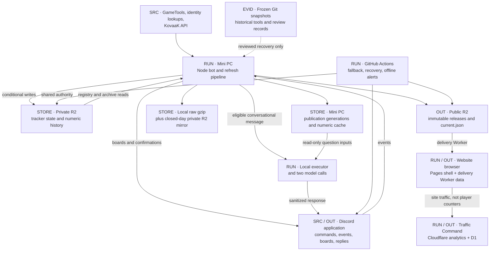

# KDM BF6 Tracker · Data-flow atlas

[Rankings website](https://raymdl.github.io/kdm-bf6-rankings/) · [Change register](REGISTER.md)

KDM BF6 Tracker collects Battlefield 6 statistics for linked clan members, publishes rankings to a website, posts standings to Discord, and answers statistics questions through the KDM Tracker Discord bot. This atlas traces each input through the Windows Mini PC, Cloudflare R2, the website, the AI reply path, the archives, and the GitHub Actions fallback.

**Checked against `1c7023b8` on 22 September 2026.**

Terms used throughout:

| Term | Meaning |
|---|---|
| Refresh | One collection of member statistics from GameTools, followed by publication |
| Envelope | The saved result of one refresh's collection; later stages read it instead of collecting again |
| Release | An immutable set of generated JSON files that the website reads together |
| Generation | A local copy of one release on the Mini PC; the AI reads it |
| Tracker day | A calendar day that starts at midnight `America/Los_Angeles` |
| Listed / unlisted | Listed members appear in public output; unlisted members are still collected |
| CAS | Compare-and-set: a write that succeeds only if the stored object has not changed since it was read (ETag check) |
| Nucleus ID | The EA account ID behind one or more BF6 personas |
| CEI, RAIS, WRR | Composite Effectiveness Index, Risk-Adjusted Impact Score and Win Rate Residual: the Effectiveness Lab scores; see [effectiveness measures](https://github.com/raymdl/kdm-bf6-rankings/blob/94af6b1a2e9c87c917153d591da5b13ffbe184c0/EFFECTIVENESS_MEASURES.md) |

## Repositories

| Repository | Revision | Role |
|---|---|---|
| [kdm-discord-bot](https://github.com/raymdl/kdm-discord-bot/tree/1c7023b8df7deda807e7e00d14820f1dfc3ada19) (private) | `1c7023b8` | Bot, collector, publisher, private-state adapters, delivery Worker, operator tools, host scripts, Actions |
| [kdm-bf6-rankings](https://github.com/raymdl/kdm-bf6-rankings/tree/94af6b1a2e9c87c917153d591da5b13ffbe184c0) | `94af6b1a` | Website shell and browser calculations |
| [kdm-bf6-archive](https://github.com/raymdl/kdm-bf6-archive/tree/e3eaddac203a9a60da572b10b9070b93a669e307) (private) | `e3eaddac` | Frozen numeric snapshot, kept for rollback |
| [bf6-analytics-dashboard](https://github.com/raymdl/bf6-analytics-dashboard/tree/7a3082c1d9f5fc8e80e63459cb6febdc44344d55) (private) | `7a3082c1` | Traffic Command: site-traffic Worker, D1 history and dashboard for the KDM Tracker and [BF6 Weapon Analyzer](https://raymdl.github.io/BF6-Weapon-Analyzer/) sites |

Source links into private repositories require access.

## D01 · Whole-system map

Arrows show data and control dependencies, not execution order.

Three stores hold authority for different things:

- **Private R2** holds the live registries and the retained numeric history.
- **Public R2** holds the files the website currently serves.
- **Local generation on the Mini PC** holds the files an AI question reads.

Website reloads and AI questions never start a GameTools collection.

## Chapters

| Chapter | Covers |
|---|---|
| [Collection and Discord](COLLECTION_DISCORD.md) | Identity linking, roster visibility, the Discord process, speedruns, KovaaK |
| [Refresh, calculations and publication](REFRESH_PUBLICATION.md) | Fresh versus cached data, pipeline stages, release publication, overtakes, calculations, artifact contract |
| [AI response path](AI.md) | Eligibility, the two model calls, local data access, logging, offline evaluation |
| [Website and traffic analytics](WEBSITE.md) | Release pinning, route data, Period calculations, delivery Worker, Traffic Command |
| [Operations and recovery](OPERATIONS.md) | Deployment, scheduling, Actions fallback, monitoring, recovery |
| [Archives and durability](ARCHIVES.md) | Storage authority and retention, historical reconstruction, disk-loss exposure |
| [Change register](REGISTER.md) | What must change together, compatibility contracts |

## Legend

| Prefix / line | Meaning |
|---|---|
| `SRC` | External or user input |
| `RUN` | Process, calculation or control path |
| `STORE` | Retained state or cache |
| `OUT` | Visible output or published artifact |
| `POLICY` | Configuration, filtering or qualification rule |
| `EVID` | Historical source or review material; not a runtime input |
| Solid arrow | Data transfer or control dependency |
| Dashed arrow | Historical, supporting or gated relationship |

`archiveGit`, `siteGit` and `easternDateKey` are legacy names. Their current behavior is described where they appear.
