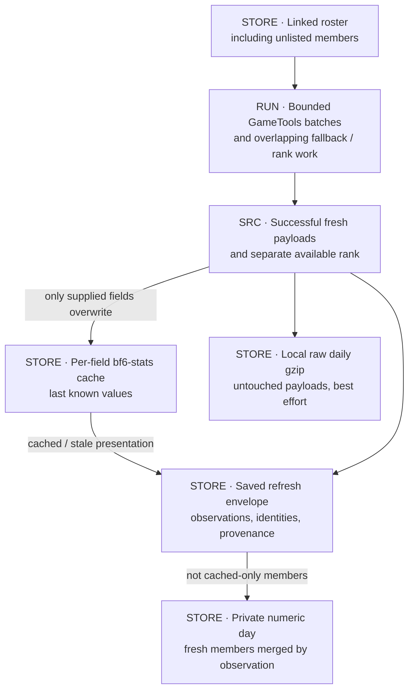
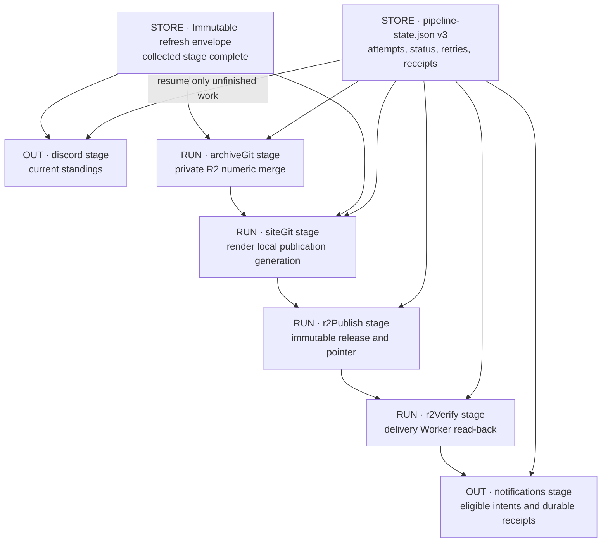
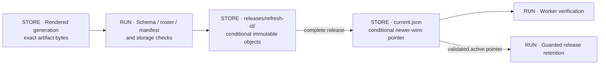
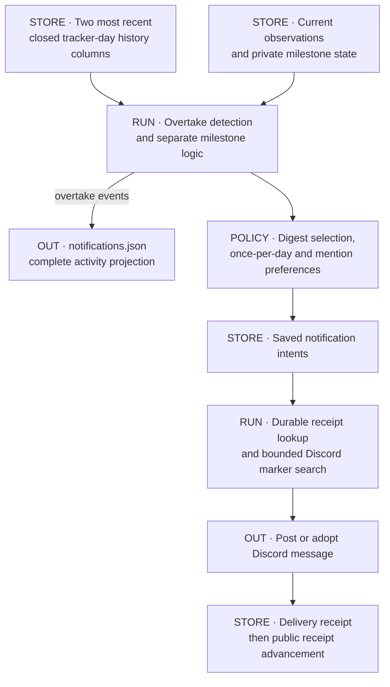
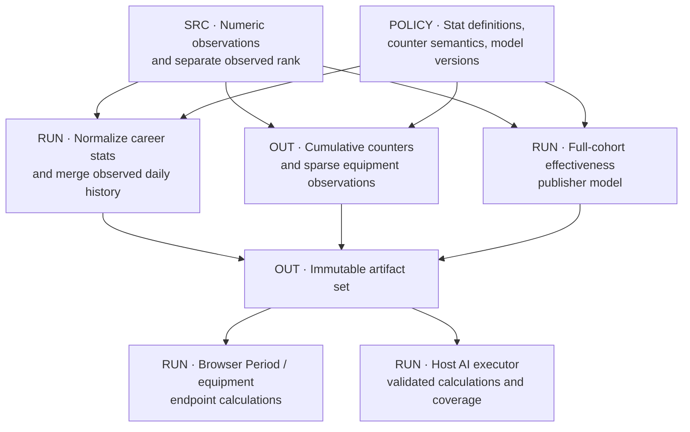

# Refresh, calculations and publication

[Atlas](README.md) · [Archives](ARCHIVES.md) · [Recovery](OPERATIONS.md)

## D07 · Fresh observations and cached presentation

Each batch entry carries the verified player ID, account ID and identity platform. Defaults are ten members per chunk and two chunks in flight. Requests use `format_values=true` because unformatted batch responses were unreliable upstream; normalization converts the values back to numbers. A hard deadline bounds the batch stage. Fast retryable failures retry within that deadline; timeouts do not. Members that fail, are missing or return invalid data fall back to individual requests. Profile rank is a separate request, and a rank failure does not discard the member's statistics.

The presentation cache and the archive treat failures differently:

- **Presentation cache.** Fresh fields replace cached fields. Missing fields keep their last value. A member whose fetch failed entirely still appears, flagged stale.
- **Numeric archive.** Only fresh payloads are archived. Within a tracker day, the newest successful payload per member wins, and a later failure does not remove an earlier success. A refresh with no fresh payloads writes nothing.
- **Raw archive.** Written best effort and monitored separately. A successful public refresh does not confirm that raw capture or its offsite mirror succeeded.

## D08 · Pipeline stages

The Discord stage runs independently; archive and publication continue if it fails. Rendering waits for the archive stage. A failed stage resumes from the saved envelope without a new GameTools request.

| Stage | Behavior in `r2` mode |
|---|---|
| `collected` | Envelope saved; collection complete |
| `discord` | Sync BF6 standings. Skipped for site-only runs. An older replay can be superseded by a newer one |
| `ownerNotifications` | Retired; kept for state compatibility |
| `archiveGit` | Merge numeric observations into private R2 (legacy name; no Git commit) |
| `siteGit` | Render the artifacts into a local publication generation (legacy name; Git copy only in `git` / `dual` modes) |
| `r2Publish` | Upload immutable objects, then conditionally advance the public pointer |
| `r2Verify` | Read the release back through the delivery Worker |
| `pages` | Skipped; kept for `git` / `dual` modes |
| `notifications` | Deliver overtake and milestone intents and record receipts |

State schema is version 3; version 2 files are normalized on load. Statuses are `pending`, `running`, `succeeded`, `failed` and `superseded`. A skipped stage is `succeeded` with a `skipped` detail. Local writes use temp-file-and-rename and are serialized. There is no transaction across Discord, both R2 buckets and the two hosts.

## D09 · Release publication

Objects are created with `If-None-Match: *`. Re-uploading identical bytes to an existing key succeeds as a retry; different bytes are rejected as a collision. The pointer update is a CAS, so concurrent publishers cannot move it backwards. Before upload, the release is checked against the listed-member set to catch a partially filtered roster. Staged bytes are kept for retries.

Retention keeps the active release and 30 superseded releases (`BF6_R2_KEEP_SUPERSEDED_RELEASES`; the source default is 5). Deletion stops if the pointer is unreadable or inconsistent, and releases newer than the pointer snapshot are protected from a concurrent pass. If verification fails after the pointer has advanced, the pointer stays where it is and needs investigation; there is no automatic rollback.

## D10 · Overtakes, milestones and delivery

Overtakes compare the two most recent closed tracker days, not intraday refreshes. The morning run normally announces the previous day's net movement. New entrants do not count as overtakes. Every site-tracked stat feeds the Activity page. The Discord digest picks at most four overtakers by impact and rivalry rules, and never headlines Time Played or bot-inclusive K/D. Mute removes the tag only.

Notification intents survive publication retries. Before posting, the sender checks saved receipts and searches the latest 100 channel messages for an embedded marker; if it finds one, it adopts that message instead of posting again. Posting and recording the receipt are two separate operations. If the process stops between them and the marker search does not find the post (for example, it is older than the last 100 messages), the next attempt posts a duplicate. Public receipt state advances only after the Discord post is confirmed. Milestone state and announcement receipts are stored privately, separate from public release retention.

## D11 · Calculations and their consumers

### Artifact contract

Paths are relative to the generated `data/` directory. The website strips its logical `data/` prefix when it resolves a URL inside an R2 release.

| Artifact | Contents | Main consumers |
|---|---|---|
| `meta.json` | Ordered stat definitions; refresh, observation and generation timestamps | All website routes, AI reader, verification |
| `latest.json` | Listed members, identities, profile links, current values, stale flags | Standings and profiles; AI identity catalogue and current values |
| `history.json` | Dense daily per-member stat values | Charts, closed-day overtakes, AI context |
| `counters.json` | Versioned cumulative counts with current-day metadata | Browser and AI Period calculations |
| `equipment-catalogue.json` | Optional item labels and categories | Equipment views, AI item resolution |
| `equipment-index.json` | Optional current equipment summaries | Career equipment views, AI current-item values |
| `equipment/<discord-id>.json` | Optional sparse equipment change points | Lazy per-player equipment history and Period views |
| `effectiveness-history.json` | CEI, RAIS, WRR and component series plus current snapshot, computed by the publisher | Effectiveness Lab (the browser does not recompute) |
| `audit.json` | Filtered administrative and link history | Audit route |
| `notifications.json` | Overtake activity and public receipt state | Activity, rivalry context, notification bookkeeping |
| `history-provenance.json` | Compact v2 markers for estimated pre-tracking history | Dashed history and Hide Backfill |
| Release manifest / `current.json` | Integrity data and release selection | Publisher, verification, retention; the browser reads the pointer |

### Numerical rules

- `BF6_STAT_CONFIG` defines the stats and their order.
- Player KPM is human-player kills divided by active class-All minutes. It differs from the upstream kills-per-minute value. Score/min and time played use the same active-time basis.
- Player K/D excludes bot kills; a separate K/D Ratio includes them. Weapon headshot percentage is separate from all-kill counts.
- A rank of zero means unavailable and is stored as missing.
- Period values are differences of cumulative counters (for example, change in human kills divided by change in deaths), not the change in lifetime K/D and not an average of daily ratios. Missing observations, carried endpoints, tracking-start limits, zero denominators and resets each have explicit handling.
- Rate stats need **15 active minutes per calendar day** of the resolved window to rank on the website. Count stats have no threshold. Player Rank is Career-only.
- Tracker days begin at midnight `America/Los_Angeles`, whatever names such as `easternDateKey` or the counters `timezone` field suggest. Today-so-far comes from `current.settled` and the artifact date axis, not the browser clock.

Consumers check for the keys each stat needs, so a counter formula-version bump alone does not disable Period views. Renaming a key breaks consumers visibly. Changing a key's meaning while keeping its name breaks them silently, because structural checks cannot detect it. Effectiveness formula changes need a model-version and fingerprint rebuild. See the [change register](REGISTER.md#change-register).

## Source anchors

[Collection/cache](../../src/bf6-cache.js), [refresh envelope](../../src/bf6-refresh-envelope.js), [pipeline](../../src/bf6-refresh-pipeline.js), [stage schema](../../src/bf6-refresh-pipeline-state.js), [numeric R2](../../src/bf6-numeric-archive-r2.js), [raw local writer](../../src/bf6-local-full-archive.js), [site publisher](../../src/bf6-site-git.js), [publication state](../../src/bf6-publication-state.js), [R2 publisher](../../src/bf6-r2-publish.js), [pointer](../../src/bf6-r2-pointer.js), [retention](../../src/bf6-r2-retention.js), [notification receipts](../../src/bf6-notification-receipts.js), [stat definitions](../../src/bf6-format.js), [counters](../../src/bf6-counters.js), [effectiveness](../../src/bf6-effectiveness.js).

Guides: [publication](../BF6_PUBLICATION.md), [data ownership](../BF6_DATA_OWNERSHIP_AND_RETENTION.md), [Period semantics](https://github.com/raymdl/kdm-bf6-rankings/blob/94af6b1a2e9c87c917153d591da5b13ffbe184c0/docs/PERIOD_VIEWS.md).
