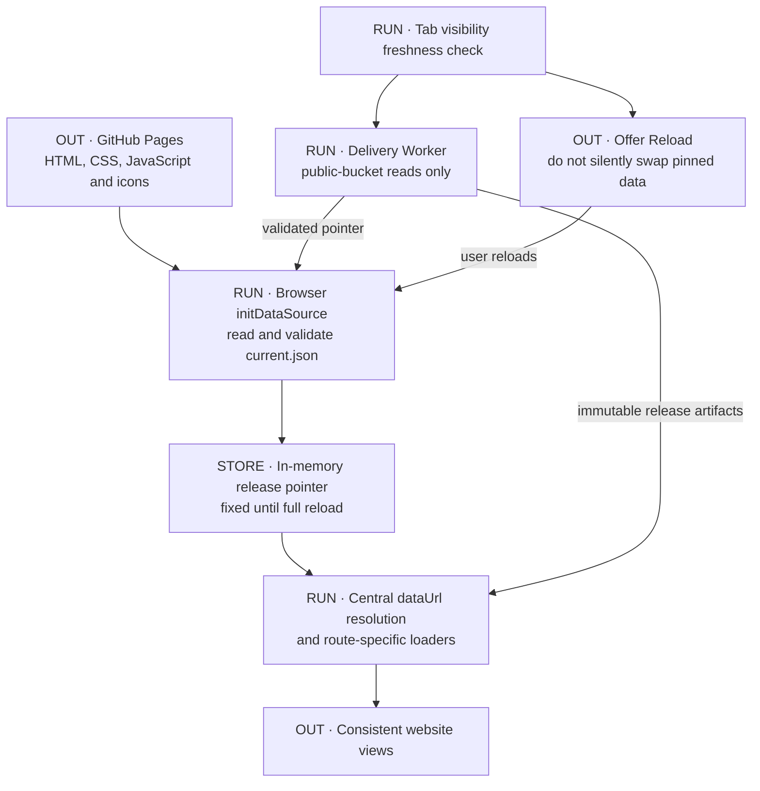
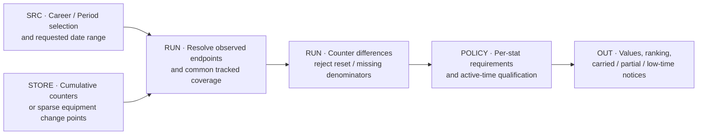
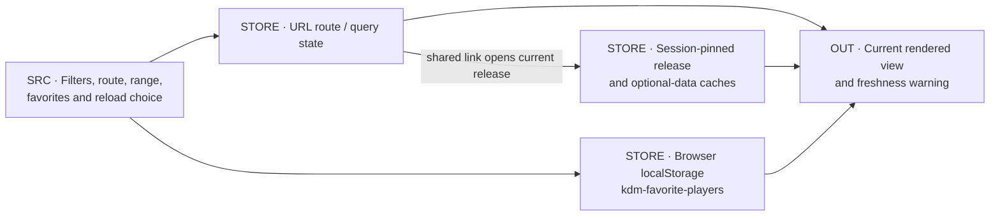
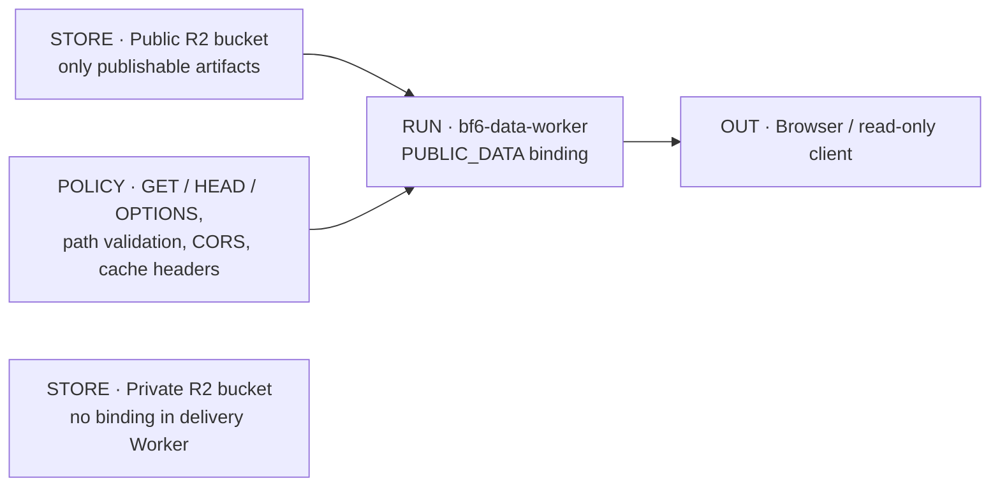
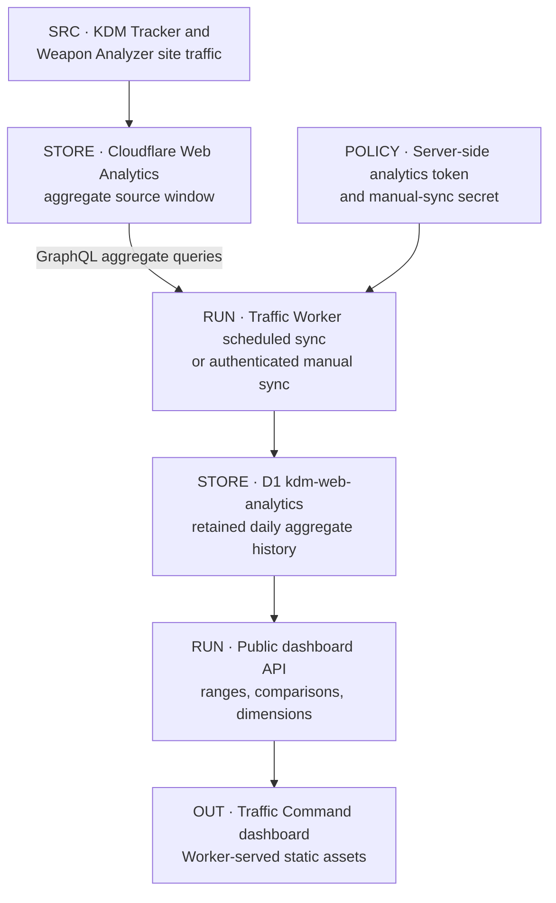

# Website and traffic analytics

[Atlas](README.md) · [Artifact contract](REFRESH_PUBLICATION.md#artifact-contract) · [Archives](ARCHIVES.md)

## D16 · One browser session, one release

The site is a no-build vanilla JavaScript application in `kdm-bf6-rankings`. GitHub Pages serves the page shell; the JSON comes from the `kdm-bf6-public-data` bucket through the delivery Worker. The repository's `data/` directory is a frozen rollback copy.

`assets/data-source.js` checks the pointer's version, identity, observation timestamp and release prefix. If the pointer is bad or unreachable, the page shows an error; it does not fall back to the frozen copy. The page keeps its first pointer until a full reload. When the tab becomes visible again, the page checks for a newer release and offers a reload instead of mixing releases.

### Route-to-artifact map

Every route reads `meta.json` and `latest.json`. Other artifacts load when a route or panel needs them.

| Surface | Additional inputs | Browser work |
|---|---|---|
| Career leaderboards / Players | History, provenance, counters as the selected view needs | Sort, compare, trend and change windows, favorite highlighting |
| Period leaderboards / Players | `counters.json` | Resolve endpoints, derive period values, apply qualification, reset and coverage rules |
| Player profile / Compare | History, provenance, counters; optional per-player equipment | Charts, pair comparisons, Career or Period windows |
| Weapon / vehicle views | Equipment catalogue and index; member change points as needed | Current equipment and endpoint-difference Period views |
| Activity | `notifications.json` | Overtake history, filters, compare links |
| Audit | `audit.json` | Administrative and link history |
| Effectiveness Lab | `effectiveness-history.json` | Render precomputed scores and components |
| Backfill treatment | `history-provenance.json` | Mark estimated cells, dashed history, Hide Backfill |

Successful optional loads are cached for the session; failed ones can retry. Player equipment history loads when its section is expanded. Chart.js loads only on Player and Compare views, pinned with an integrity hash; if it fails, tables still render. Platform icons are vendored.

## D17 · Period and equipment calculations

- **Career** shows lifetime values. Its range selects the change and trend window.
- **Period** shows performance between two resolved tracked endpoints. Today is in progress, as defined by artifact metadata. All Time in Period means each member's tracked history, not lifetime play.
- Rate stats need 15 active minutes per resolved calendar day to rank. Rows below the threshold stay visible, unranked.
- A negative counter difference is treated as a reset or correction.

The producer's counter definitions, the website's `PERIOD_STAT_DEFS` and the AI executor must agree on what each counter key means ([change register](REGISTER.md#change-register)). Equipment Period coverage starts on the date each counter was first archived.

## D18 · URL state, preferences and freshness

A shared URL keeps the route and filters; it opens against the current release, not the one the sender saw. Favorites live in `localStorage` in one browser. JavaScript and CSS changes deploy through the shared `?v=` import version, separate from data caching.

Data older than eight hours is marked stale. The cause can be a missed collection, a stuck publication, a bad pointer or a delivery failure; reloading the page does not fix any of them. Timestamps display in Eastern time; tracker-day arithmetic uses Pacific midnight.

## D19 · Delivery Worker

The Worker allows `GET`, `HEAD` and `OPTIONS` only. `current.json` is served `no-cache` with ETag support; release paths are cached as immutable for one year; errors are not cached. CORS allows the Pages origin and localhost / 127.0.0.1 on ports 4173 and 4174.

CORS does not restrict who can read: any valid key in the public bucket is readable by anyone. Only publishable data belongs in that bucket. The Worker has no private-bucket binding and does no collection, AI or calculation work.

To move data delivery back to Pages, first rebuild and verify fresh Pages data, then change the browser's `DATA_SOURCE` setting. Changing the setting alone would serve the frozen copy as if it were current. Worker deploys and Pages deploys are separate from data publication.

## D20 · Traffic Command

`bf6-analytics-dashboard` records page traffic for the KDM Tracker and Weapon Analyzer sites. It holds no player statistics, and its data does not feed rankings or AI answers.

The Worker queries Cloudflare's GraphQL analytics API with a server-side token and writes daily aggregates to D1. A daily sync at 05:17 UTC refreshes the last seven days and backfills 28-day blocks across Cloudflare's 183-day window. D1 keeps collected rows indefinitely. `sync_state` records the requested date range, and only days with returned traffic get a row; the dashboard shows missing days as zero. A synced range can therefore contain days with no stored row.

| Interface | Behavior |
|---|---|
| `GET /api/dashboard` | Public daily views and visits, previous-period comparison, coverage and dimensions, read from D1 with a short public cache |
| `GET /api/health` | Configuration presence and database health; no secret values |
| `POST /api/sync` | Bearer-secret manual sync, up to 31 days |
| Scheduled handler | Recent-day refresh and progressive backfill |
| Asset binding | Dashboard HTML, CSS and JavaScript |

The dashboard can show either site or both. Dimensions are pages, referrers, countries, devices and browsers; Cloudflare-identified bots are excluded. The analytics token and sync secret stay on the server.

## Source anchors

Site: [entry module](https://github.com/raymdl/kdm-bf6-rankings/blob/94af6b1a2e9c87c917153d591da5b13ffbe184c0/assets/app.js), [data source](https://github.com/raymdl/kdm-bf6-rankings/blob/94af6b1a2e9c87c917153d591da5b13ffbe184c0/assets/data-source.js), [Period engine](https://github.com/raymdl/kdm-bf6-rankings/blob/94af6b1a2e9c87c917153d591da5b13ffbe184c0/assets/period.js), [equipment](https://github.com/raymdl/kdm-bf6-rankings/blob/94af6b1a2e9c87c917153d591da5b13ffbe184c0/assets/equipment.js), [route state](https://github.com/raymdl/kdm-bf6-rankings/blob/94af6b1a2e9c87c917153d591da5b13ffbe184c0/assets/view-state.js), [loading guide](https://github.com/raymdl/kdm-bf6-rankings/blob/94af6b1a2e9c87c917153d591da5b13ffbe184c0/docs/DATA_LOADING.md).

Delivery: [Worker source](../../cloudflare/bf6-data-worker/src/index.js), [configuration](../../cloudflare/bf6-data-worker/README.md), [operations](../BF6_R2_OPERATIONS_RUNBOOK.md).

Traffic: [Worker](https://github.com/raymdl/bf6-analytics-dashboard/blob/7a3082c1d9f5fc8e80e63459cb6febdc44344d55/src/worker.js), [site definitions](https://github.com/raymdl/bf6-analytics-dashboard/blob/7a3082c1d9f5fc8e80e63459cb6febdc44344d55/src/sites.js), [D1 schema](https://github.com/raymdl/bf6-analytics-dashboard/blob/7a3082c1d9f5fc8e80e63459cb6febdc44344d55/migrations/0001_initial.sql), [deployment configuration](https://github.com/raymdl/bf6-analytics-dashboard/blob/7a3082c1d9f5fc8e80e63459cb6febdc44344d55/wrangler.jsonc), [dashboard guide](https://github.com/raymdl/bf6-analytics-dashboard/blob/7a3082c1d9f5fc8e80e63459cb6febdc44344d55/README.md).
